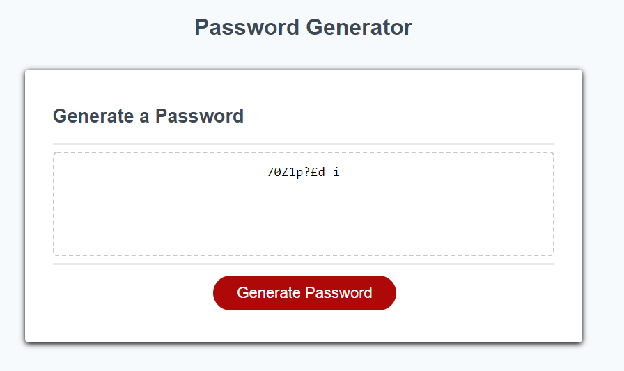

# Random Password Generator

## Description
[Link to the webpage](https://cleggatron.github.io/RandomPasswordGenerator/)

This webpage provides prompts that allow the user to generate a custom password, with varying levels of complexity. The user can select between lowercase, uppercase, number, and symbols. THe user can also specify the length, though enforced minimum/maximum lengths are included.

## Installation

As this is a webpage then there is no installation required.

## Usage

Once the user clicks the "Generate Password" button they will receive sequential prompts where they chose the length and complexity of the password. 

The character types chosen are stored in an array which then allows for access to the arrays of available characters. The program loops through this for the total length of the array.

## Credits

The original page template was provided by the University of Birmingham Bootcamp at the following repo [https://birmingham.bootcampcontent.com/university-of-birmingham/ubhm-brm-fsf-pt-05-2021-u-c/tree/master/03-JavaScript/02-Homework](https://birmingham.bootcampcontent.com/university-of-birmingham/ubhm-brm-fsf-pt-05-2021-u-c/tree/master/03-JavaScript/02-Homework)

## License

Copyright (c) [2021] [David Clegg]

Permission is hereby granted, free of charge, to any person obtaining a copy of this software and associated documentation files (the "Software"), to deal in the Software without restriction, including without limitation the rights to use, copy, modify, merge, publish, distribute, sublicense, and/or sell copies of the Software, and to permit persons to whom the Software is furnished to do so, subject to the following conditions:

The above copyright notice and this permission notice shall be included in all copies or substantial portions of the Software.

THE SOFTWARE IS PROVIDED "AS IS", WITHOUT WARRANTY OF ANY KIND, EXPRESS OR IMPLIED, INCLUDING BUT NOT LIMITED TO THE WARRANTIES OF MERCHANTABILITY, FITNESS FOR A PARTICULAR PURPOSE AND NONINFRINGEMENT. IN NO EVENT SHALL THE AUTHORS OR COPYRIGHT HOLDERS BE LIABLE FOR ANY CLAIM, DAMAGES OR OTHER LIABILITY, WHETHER IN AN ACTION OF CONTRACT, TORT OR OTHERWISE, ARISING FROM, OUT OF OR IN CONNECTION WITH THE SOFTWARE OR THE USE OR OTHER DEALINGS IN THE SOFTWARE.
